# [25 Days of Serverless](https://25daysofserverless.com)
[CHALLENGE 17: AZURE IOT HUB](https://25daysofserverless.com/calendar/17)

The solution to the problem is implemented steps shown below

#### 1)	Create an IOT Hub in Azure Portal

#### 2)	Register a new device under the IOT hub and copy the connection string

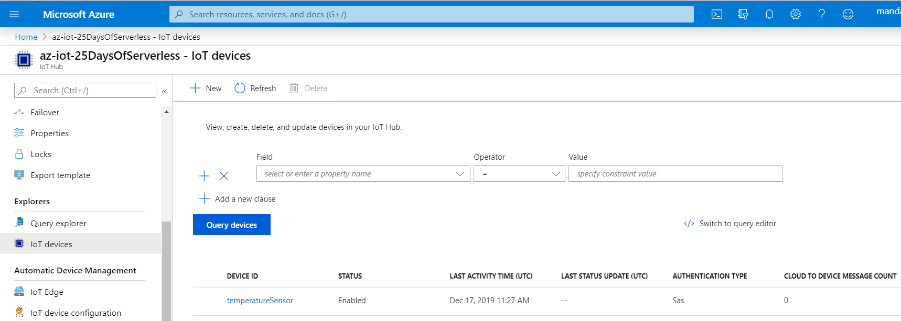

#### 3)	Copy the Connection String from the device

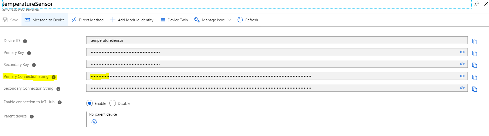

#### 4)	Copy the connection link into the PI Simulator.

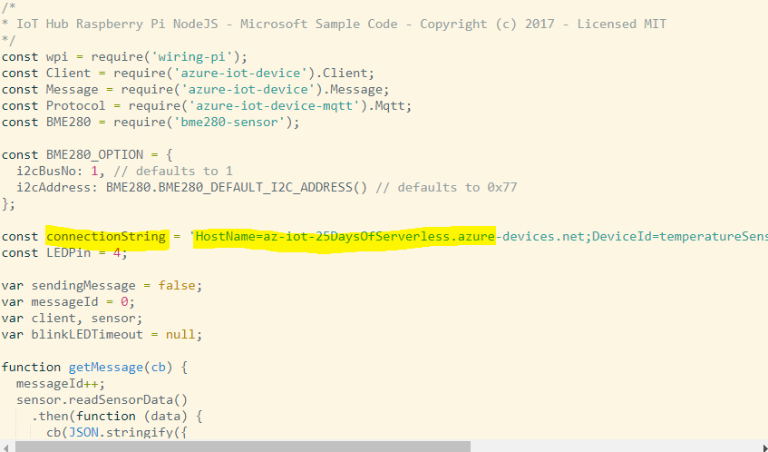

#### 5)	Change the Temperature threshold to 31 Degree Celsius.

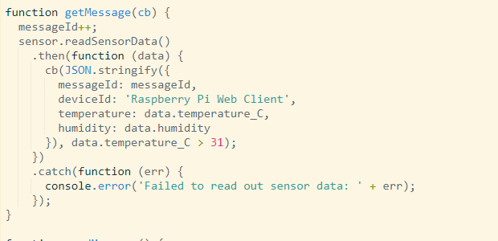

#### 6)	Create a Logic App with HTTP Request trigger and Post a tweet action

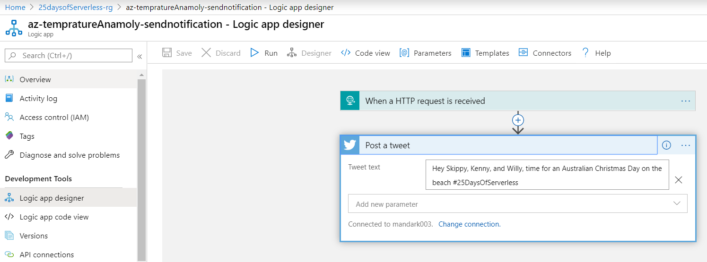

#### 7)	Register the logic app as a webhook event grid subscriber in IOT Hub Created in step 1. Add data.properties.temperatureAlert contains true filter as shown

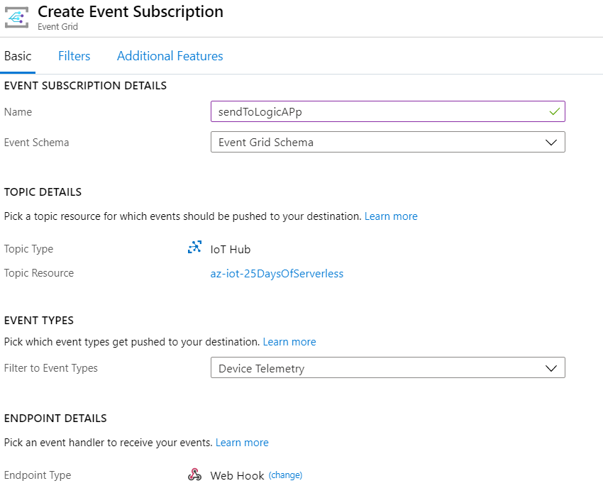

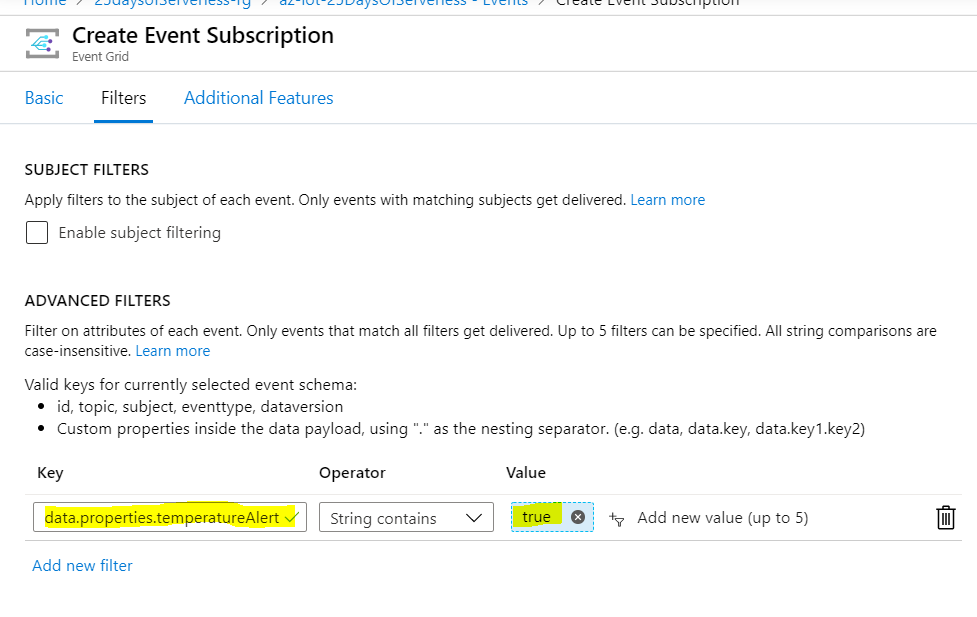

#### 8)	Final Screen Shot after subscribing to events

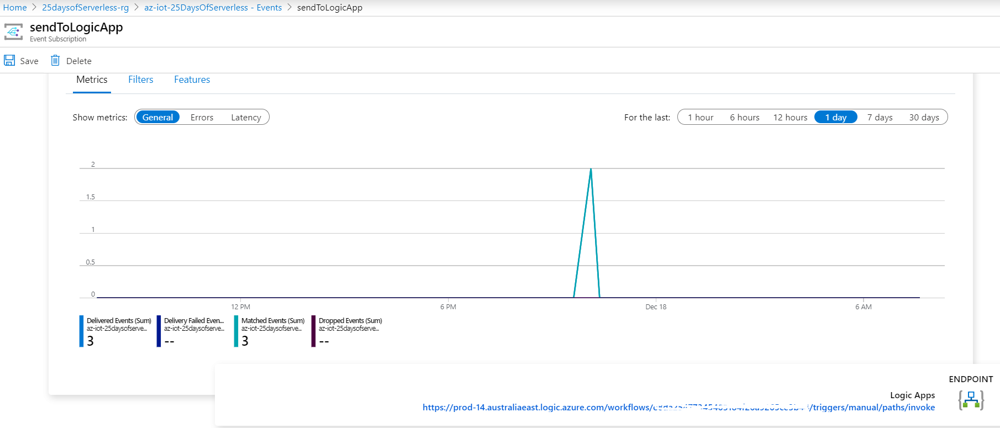

## Test

#### Run the Pi Simulator and see the magic happen. Sample logic app run shown below.

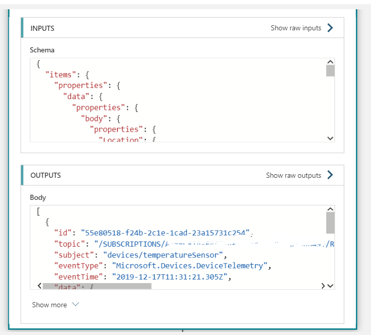

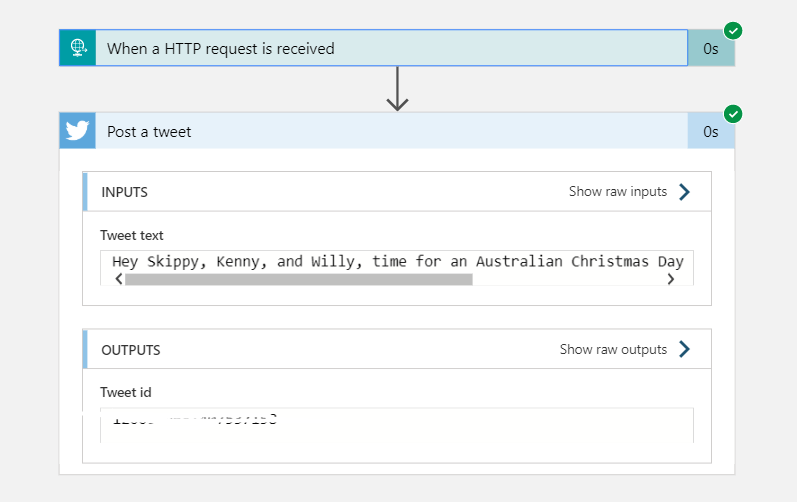

#### Posted Tweet on Twitter

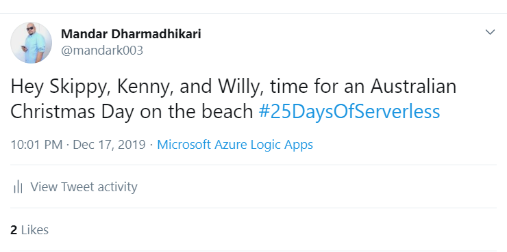

# Verdict

## Ho HO HO SANTA IS HAPPY
